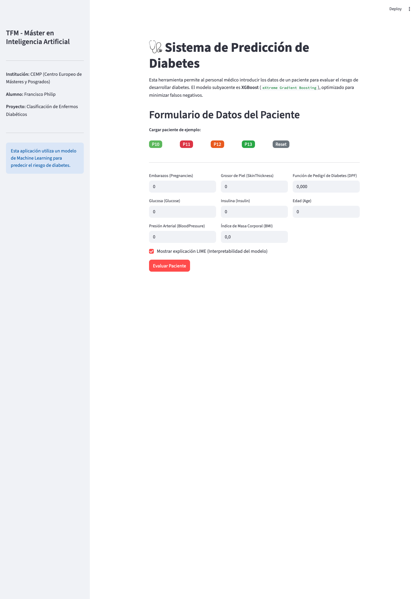
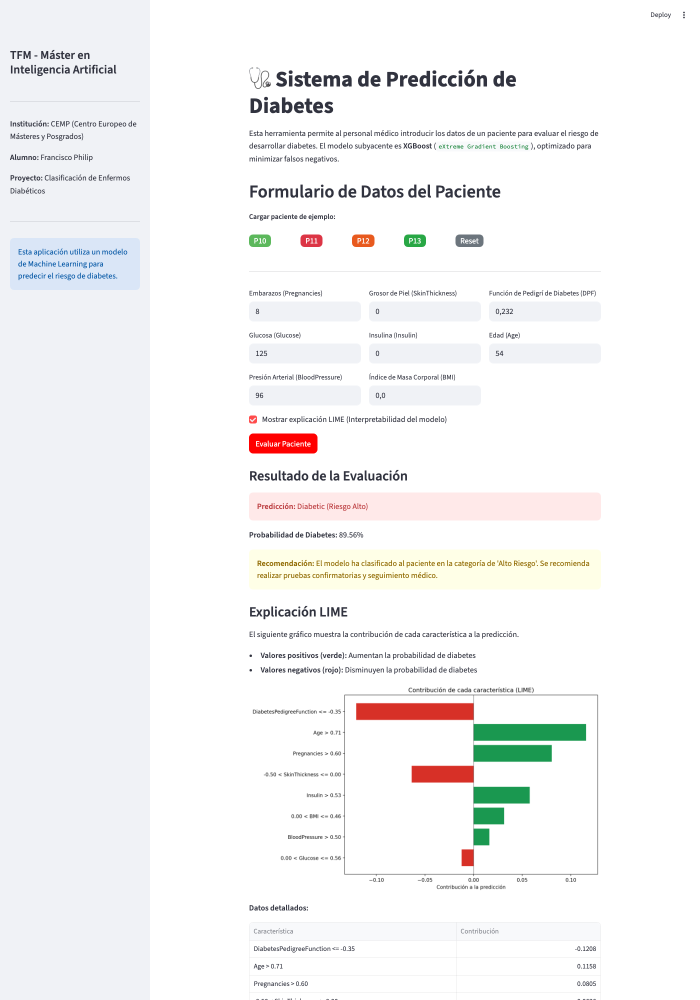
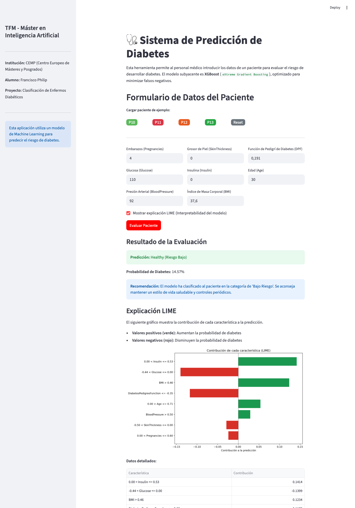
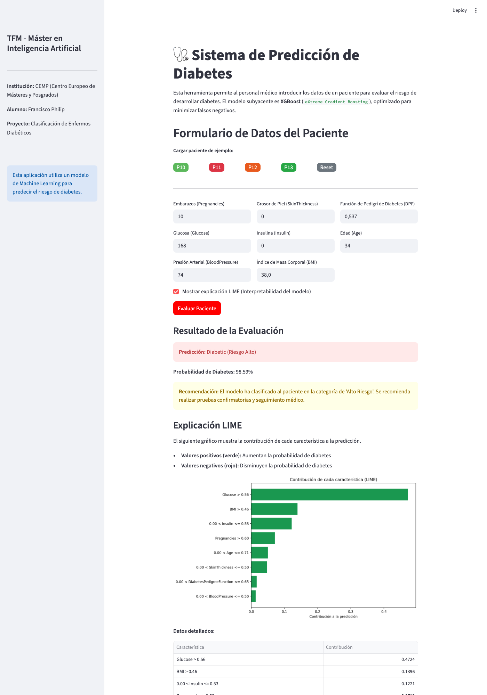
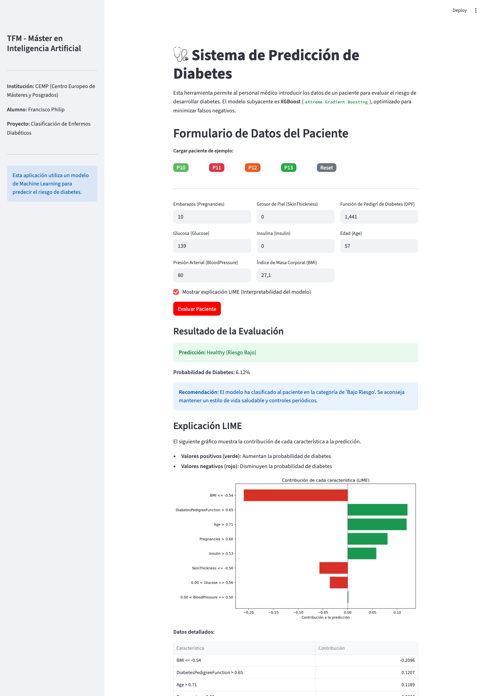

# TFM: Sistema de Predicción de Diabetes con MLOps

Este repositorio contiene el código fuente y la configuración para el despliegue de un sistema de predicción de diabetes, como parte del Trabajo Fin de Máster en Inteligencia Artificial del CEMP.

## 📝 Descripción del Proyecto

El objetivo de este proyecto es proporcionar una herramienta funcional y desplegable que utiliza un modelo de Machine Learning para predecir el riesgo de diabetes en pacientes. El sistema está compuesto por un backend (API REST) que sirve el modelo y un frontend (interfaz web) para la interacción del usuario.

### Componentes Clave

- **Modelo de ML**: `eXtreme Gradient Boosting` entrenado con el dataset "Pima Indians Diabetes".
- **Pipeline de Preprocesamiento**: Imputación con `KNNImputer` y escalado con `RobustScaler`.
- **Interpretabilidad**: Explicaciones con **LIME** (Local Interpretable Model-agnostic Explanations).
- **Backend**: API REST desarrollada con **FastAPI**, que expone endpoints `/predict` y `/explain`.
- **Frontend**: Interfaz gráfica interactiva creada con **Streamlit**.
- **Orquestación**: Docker y Docker Compose para crear un entorno reproducible y aislado.

## 📂 Estructura del Repositorio

```
.
├── Dockerfile              # Define la imagen de Docker para los servicios.
├── docker-compose.yml      # Orquesta el despliegue de la API y el frontend.
├── requirements.txt        # Dependencias de Python.
├── README.md               # Este archivo.
├── models/                 # Artefactos del modelo (generados por train_model.py).
│   ├── model.pkl           # Modelo XGBClassifier entrenado.
│   ├── imputer.pkl         # KNNImputer para valores faltantes.
│   ├── scaler.pkl          # RobustScaler para normalizacion.
│   ├── X_train_scaled.pkl  # Datos de entrenamiento escalados (para LIME).
│   └── feature_names.pkl   # Nombres de las caracteristicas (para LIME).
├── datasets/
│   ├── diabetes.csv        # Dataset original de entrenamiento (Pima Indians).
│   └── test.csv            # Dataset de prueba para validacion del modelo.
├── results/                # Reportes de test generados automaticamente.
│   └── test_results_*.md   # Reportes con timestamp de cada ejecucion.
├── docs/
│   └── images/             # Capturas de pantalla para documentacion.
│       ├── 06_frontend_empty.png
│       ├── 08_frontend_p10_result.png
│       ├── 10_frontend_p11_result.png
│       ├── 12_frontend_p12_result.png
│       └── 14_frontend_p13_result.png
├── scripts/
│   └── take_screenshots.py # Script Playwright para generar capturas.
└── src/
    ├── train_model.py      # Script para entrenar el modelo.
    ├── test_model.py       # Script para testear y generar reportes.
    ├── main.py             # API REST con FastAPI.
    └── frontend.py         # Interfaz web con Streamlit.
```

## 🚀 Como Ejecutar el Proyecto

### Opcion 1: Ejecucion Local (Desarrollo)

#### Prerrequisitos

- Python 3.9+
- pip (gestor de paquetes)

#### Paso 1: Instalar dependencias

```bash
pip install -r requirements.txt
```

#### Paso 2: Entrenar el modelo

```bash
python src/train_model.py
```

Esto genera los artefactos en `models/`:
- `model.pkl` - Modelo XGBClassifier
- `imputer.pkl` - KNNImputer para valores faltantes
- `scaler.pkl` - RobustScaler para normalizacion
- `X_train_scaled.pkl` - Datos de entrenamiento escalados (para LIME)
- `feature_names.pkl` - Nombres de las caracteristicas (para LIME)

#### Paso 3: Ejecutar la API

```bash
uvicorn src.main:app --host 0.0.0.0 --port 8000
```

O alternativamente:

```bash
python -m uvicorn src.main:app --reload --port 8000
```

#### Paso 4: Acceder a la API

Abre tu navegador en: **http://localhost:8000/docs**

> Para una guia detallada de la API, consulta [docs/API_GUIDE.md](docs/API_GUIDE.md)

---

### Guia Visual del Frontend (Streamlit)

El frontend permite evaluar pacientes de forma interactiva con explicaciones LIME.

#### Formulario de Evaluacion

Al acceder a `http://localhost:8501` veras el formulario de evaluacion:



#### Casos de Ejemplo (Preset)

El sistema incluye 4 pacientes predefinidos del dataset para demostrar las capacidades del modelo:

| Preset | Diagnostico Real | Color Boton | Descripcion |
|--------|------------------|-------------|-------------|
| P10 | Diabetico | Verde claro | Riesgo moderado |
| P11 | Sano | Rojo | Alto riesgo (falso positivo esperado) |
| P12 | Diabetico | Naranja | Riesgo alto |
| P13 | Sano | Verde | Bajo riesgo |

#### Paciente P10 - Diabetico (Riesgo moderado)



#### Paciente P11 - Sano (Alto riesgo)



#### Paciente P12 - Diabetico (Riesgo alto)



#### Paciente P13 - Sano (Bajo riesgo)



#### Interpretacion con LIME

Cada prediccion incluye una explicacion LIME que muestra:
- **Barras verdes**: Caracteristicas que aumentan la probabilidad de diabetes
- **Barras rojas**: Caracteristicas que disminuyen la probabilidad de diabetes
- **Tabla detallada**: Valores numericos de cada contribucion

---

### Opcion 2: Ejecucion con Docker (Produccion)

#### Prerrequisitos

- Docker y Docker Compose instalados
- Conexion a internet

#### Pasos

1.  **Clonar el Repositorio**
    ```bash
    git clone https://github.com/fphilip/ml-diabetes-test.git
    cd ml-diabetes-test
    ```

2.  **Entrenar el Modelo (Primer Uso)**
    ```bash
    python src/train_model.py
    ```

3.  **Levantar los Servicios con Docker Compose**
    ```bash
    docker-compose up --build
    ```

4.  **Acceder a los Servicios**
    - **Frontend (Streamlit)**: http://localhost:8501
    - **Backend (API Docs)**: http://localhost:8000/docs

5.  **Detener los Servicios**
    ```bash
    docker-compose down
    ```

## 🧪 Testing del Modelo

El proyecto incluye un sistema de testing automatizado que valida el modelo contra un dataset de prueba y genera reportes detallados.

### Ejecutar Tests

```bash
python src/test_model.py
```

### Que hace el script de test

1. **Carga los artefactos** del modelo entrenado desde `models/`:
   - `model.pkl` - Modelo XGBClassifier
   - `imputer.pkl` - KNNImputer para valores faltantes
   - `scaler.pkl` - RobustScaler para normalizacion

2. **Carga el dataset de prueba** desde `datasets/test.csv`

3. **Aplica el mismo preprocesamiento** que en entrenamiento:
   - Reemplaza ceros por NaN en columnas biologicas (Glucose, BloodPressure, SkinThickness, Insulin, BMI)
   - Aplica imputacion con KNNImputer
   - Escala con RobustScaler

4. **Genera predicciones** y calcula metricas:
   - Accuracy, Precision, Recall, F1-Score
   - Matriz de confusion
   - Probabilidades por muestra

5. **Crea un reporte MD** en `results/test_results_YYYYMMDD_HHMMSS.md` con:
   - Resumen de metricas
   - Matriz de confusion con interpretacion
   - Tabla detallada de cada prediccion
   - Analisis de errores (falsos positivos/negativos)

### Dataset de Test

El archivo `datasets/test.csv` contiene los casos a evaluar. Formato:

```csv
Pregnancies,Glucose,BloodPressure,SkinThickness,Insulin,BMI,DiabetesPedigreeFunction,Age,Outcome
6,148,72,35,0,33.6,0.627,50,1
1,85,66,29,0,26.6,0.351,31,0
...
```

- **Outcome**: Valor real (0=No diabetico, 1=Diabetico)
- Puedes modificar este archivo para probar con diferentes casos

### Reportes Generados

Cada ejecucion genera un nuevo reporte en `results/` con timestamp unico. Ejemplo de contenido:

| Metrica | Valor |
|---------|-------|
| Accuracy | 89.97% |
| Precision | 89.96% |
| Recall | 80.22% |
| F1-Score | 84.81% |

## ⚙️ Detalles Tecnicos

### Umbral de Decision

El modelo utiliza un umbral de probabilidad de **0.18** para clasificar a un paciente como "Diabético". Este valor fue optimizado para maximizar la sensibilidad (Recall) del modelo, reduciendo así el riesgo de falsos negativos, un aspecto crítico en diagnósticos médicos.

### Endpoints de la API

- **`POST /predict`**:
  - **Payload (JSON)**:
    ```json
    {
      "Pregnancies": 6,
      "Glucose": 148,
      "BloodPressure": 72,
      "SkinThickness": 35,
      "Insulin": 0,
      "BMI": 33.6,
      "DiabetesPedigreeFunction": 0.627,
      "Age": 50
    }
    ```
  - **Respuesta (JSON)**:
    ```json
    {
      "prediction": "Diabetic",
      "probability": 0.65,
      "risk_level": "High"
    }
    ```

---
**TFM - Máster en Inteligencia Artificial - CEMP**
- **Alumno:** Francisco Philip Garcia-Diez

